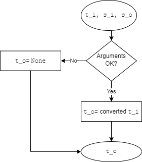

# **`convert_temperature`**

Specification file for `convert_temperature` function.

 

## 1. Requirements
---

### 1.1 ID
---
> f_005

 

### 1.2 Signature
---
> `t_2 = convert_temperature(t_i, s_i, s_o)`

 

### 1.3 Type and language
---
> Python function

 

### 1.4 Purpose
---
> Convert temperature between the following scales: celsius, farenheit and kelvin

 

### 1.5 Inputs
---

| Input | Description | Type & Domain |
|---|---|---|
| `t_i` | Tempareture input | *real number*   `int/float`
| `s_i` | Scale input | *string*   `str`
| `s_o` | Scale output | *string*   `str`

 

### 1.6 Outputs
---
| Output | Description | Type & Domain |
|---|---|---|
| `t_o` | Temparature output | *real number*   `int/float` |

 

## 1. Test cases
---

| Id | `t_i` | `s_i` | `s_o` | Output expected |
|---|---|---|---|---|
| 1 | `None` | `None` | `None` | None |
| 2 | `25` | `CELSIUS` | `FAHRENHEIT` | 77.0 |
| 3 | `25` | `CELSIUS` | `FAHRENHEITT` | None |
| 4 | `25` | `CELSIUS` | `None` | None |
| 5 | `-273` | `CELSIUS` | `KELVIN` | 0.15 |

 

## 2. Algorithm
---
 

